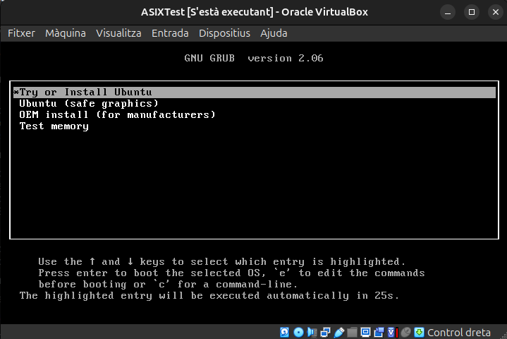

# Instal·lació 

El que hem fet ha sigut fer la instal·lació del sistema operatiu Ubuntu 22 des del principi amb el virtual box. 

El primer que hem de fer és clicar al botó on posa nova, on hi ha un botó blau a la part superior de la aplicació. Una vegada fet això, ja podrem afegir la iso del Ubuntu 22 on diu ISO Image. Haurem de clicar en la casella on diu Skip Unattended Installation, que serveix per a fer una instalació manual des de zero del Ubuntu

Un cop col·locada la ISO i marcada la casella, podem clicar al botó d'endavant. Haurem de posar uns 5GB de RAM i 3 nuclis per a que la màquina virtual pugui funcionar d'una manera adient.

Tornem a clicar el botó d'endavant i podrem observar una pestanya on diu "Disk Size" Això significa la capacitat màxima que pot arribar a tenir el disc dur dintre de la màquina virtual. No us preocupeu que més avant es pot arribar a editar la capacitat màxima.

Una tinguis la màquina preparada, pots iniciar-la clicant dues vegades damunt del nom de la màquina virtual, un cop oberta, et surtirà aquest menú. L'únic que has de fer és donar-li a la tecla enter.

Quan ja hagis clicat a la tecla enter, ja estirás dintre del Sistema Operatiu d'ubuntu, ara només fa falta preparar la instal·lació. Li donem a l'opció "Instalar Ubuntu"

Ara només fa falta seleccionar l'idioma amb el qual volem utilitzar el sistema operatiu, en aquest cas, jo utilitzaré el Castellà

Després de selccionar l'idioma, cliquem continuar, fins arribar a la següent pestanya de la imatge. On podem posar l'usuari i la contrasenya d'usuari dintre de la màquina virtual. Un cop posades totes les dades, cliquem continuar.

Un cop finalitzada la configuració, començarà el procés d'instal·lació, haurem d'esperar un 10 minuts per a que la instalacio del Ubuntu 22 finalitzi i quan acabi ens demarà que reiniciem el sistema. Li donem a reiniciar ara i ja podrem accedir a la màquina virtual iniciant sessió amb l'usuari i la contrasenya configurades anteriorment. 

