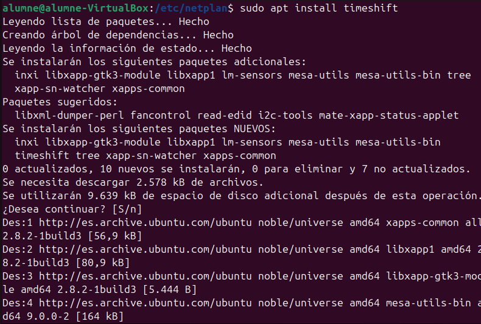
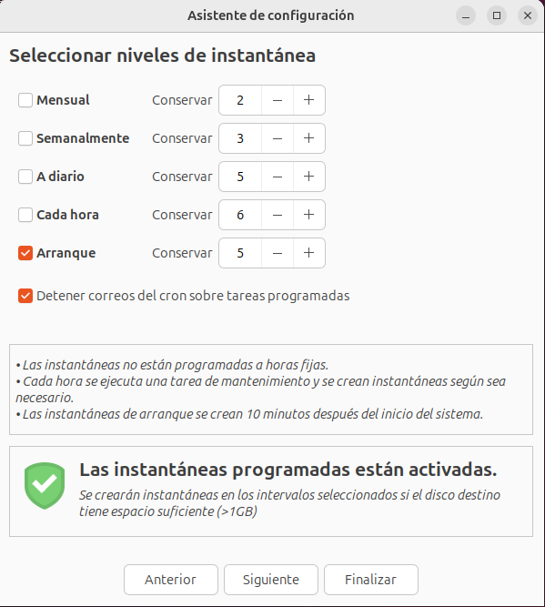

# Instal·lació de programes

Aquí farem una instal·lació del programa timeshift i farem una còpia de seguretat amb aquest programa

Al obrir el programa Timeshift s'obrirà aquesta pestanya, on clicarem seguent. 

Aquí seleccionem que faci una instantanea cada vegada que s'arranqui el sistema. 

Creem una instantanea amb el botó marcat amb la fletxa. 

Com podem comprobar, aquí tenim la còpia. 

Aquestes son algunes de les comandes que també utilitzarem per a la instal·lació de programes.

