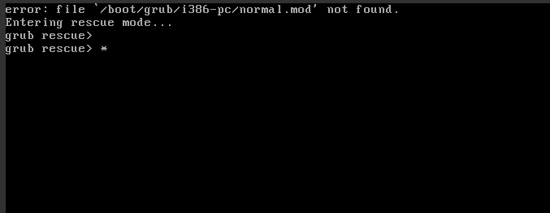

# Punts de restauració

Aquí ensenyarem com recuperar el sistema operatiu en cas de que no s'arranqui amb dues eines diferents

Primer, per a provar com fer-ho haurem d'eliminar la carpeta grub, utilitzant la següent comanda al terminal de la màquina virtual:


```
sudo rm -rf /boot/grub/
```


Un cop tenim el grub eliminat de la màquina virtual, hem de reiniciar la màquina i ens sortira aquest menú cada vegada que vulguem iniciar-la



Parem la màquina virtual, i al menú del Virtual Box, cliquem l'opció marcada amb la fletxeta, i després sel·leccionem la ISO amb el següent enllaç: 
```
https://sourceforge.net/projects/supergrub2/files/2.06s4/super_grub2_disk_2.06s4/supergrub2-classic-2.06s4-multiarch-CD.iso/download
```


Iniciem la màquina amb la iso col·locada i llavors al iniciar-la, podrem veure un menú amb diferentes opcions, seleccionarem la que diu "Detect and show boot methods" i presionem enter


Ara seleccionem la següent opció


Un cop fem aixo, el ordinador funcionarà correctament, però haurem de fer diverses comandes al terminal.

```
install /dev/sda
```
```
sudo update-grub2
```

```
sudo apt-get install grub2
```